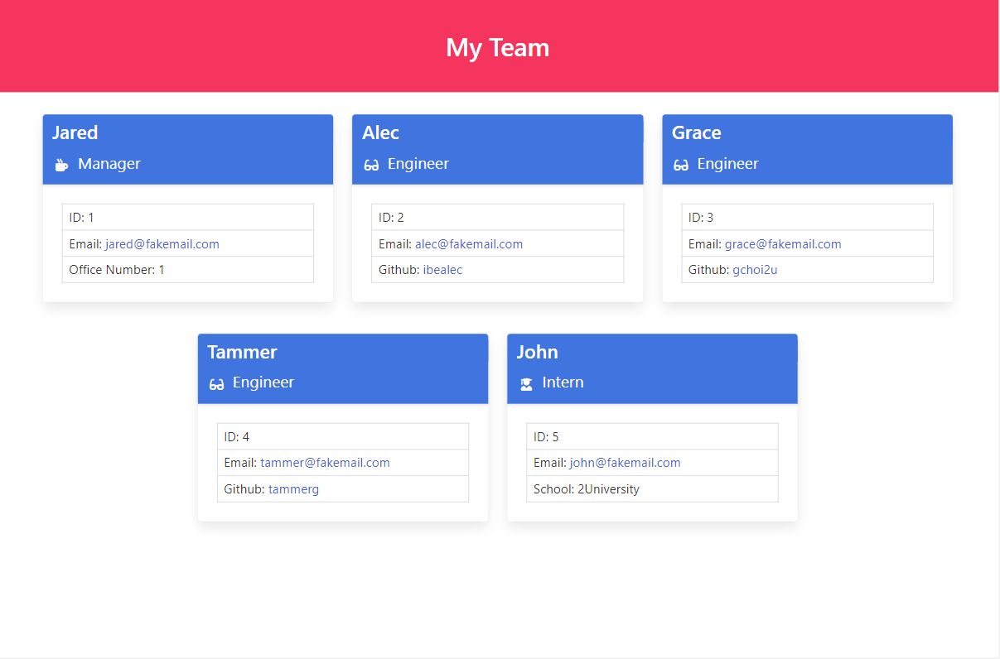

# team-profile-generator

[](https://opensource.org/licenses/MIT)

## Description

A Node.js command-line application that takes in information about employees on a software engineering team, then generates an HTML webpage that displays summaries for each person.

The code will also be solidified via unit tests which will be added for main parts of the code and ensure that it passes each test.

## Table of Contents

- [Description](#description)
- [Installation](#installation)
- [Usage](#usage)
- [Directory Structure](#directory-structure)
- [Technologies Used](#technologies-used)
- [Tests](#tests)
- [Features](#features)
- [Appearance](#appearance)
- [Setup](#setup)
- [Demo](#demo)
- [Acknowledgements](#acknowledgements)
- [Questions](#questions)
- [License](#license)

## Installation

​Install dependencies using:

    npm install

## Usage

The application will be invoked by using the following command:

    node index.js

## Directory Structure

```md
.
├── **tests**/
│ ├── Employee.test.js
│ ├── Engineer.test.js
│ ├── Intern.test.js
│ └── Manager.test.js
├── assets/
├── dist/
├── lib/
├── src/
├── .gitignore
├── index.js
└── package.json
```

## Technologies Used

- Node.js
- Jest
- Inquirer
- JavaScript
- HTML
- CSS
- Bulma framework
- Font Awesome

## Tests

Run test using:

    npm run test

## Features

The app is also interactivity on mutliple screen size devices and powered by Bulma

## Appearance



## Setup

-Text editor (VS Code recommended)
-An Internet browser (Google Chrome recommended)

## Demo

Refer to the demo in the link provided

## Acknowledgements

- https://bulma.io/
- https://www.npmjs.com/package/jest
- https://www.npmjs.com/package/inquirer

## Questions

Created by: [@moedaaboul](https://github.com/moedaaboul)

Feel free to contact me via [muhammad.daaboul1989@gmail.com](muhammad.daaboul1989@gmail.com)!

## License

This work is licensed under
[MIT](#).
